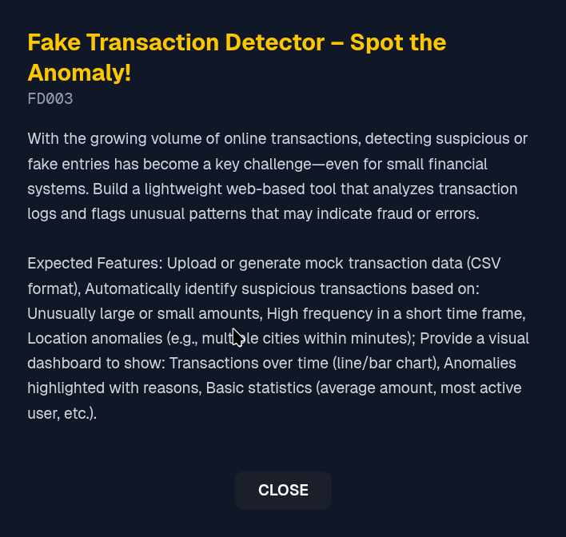

# 🏦 Explainable Transaction Anomaly Monitoring System

> A hackathon project for explainable banking transaction anomaly detection with CLI and API support

---

## 📋 Problem Statement



Modern banking systems must **monitor transactions in real-time** to identify fraud, account misuse, and suspicious behavior. However, traditional approaches face critical challenges:

- **Fraud labels are rare, delayed, or noisy** — making supervised learning unreliable
- **Models must be explainable** — banking regulations require transparency in decision-making
- **Systems must work offline** , support batch & CLI-based ingestion, and be auditable for compliance

---

## 💡 Our Solution

We built an **explainable, rule-based transaction monitoring system** that:

- ✅ **Flags high-risk anomalous transactions** using multi-signal detection
- ✅ **Explains why** each transaction is flagged with human-readable reasons
- ✅ **Works even when user history is sparse** through smart feature engineering
- ✅ **No black-box ML** — every decision is transparent and auditable
- ✅ **Supports** both CLI and frontend uploads
- ✅ **Stores results** in MongoDB for analytics and auditability

### Key Features
- CSV ingestion via CLI and FastAPI
- Amount- and behavior-based anomaly detection
- Device/IP/Location change tracking
- Risk scoring with detailed explanations
- CSV export of flagged transactions
- Analytics APIs for dashboards


---

## 🔄 System Architecture & Pipeline


```md
CLI / Frontend
      ↓
FastAPI Upload Route
      ↓
Shared Ingestion Service
      ↓
Explainable Anomaly Engine
      ↓
MongoDB
      ↓
Analytics & Transaction APIs
```

---

## 🚀 Getting Started

### Prerequisites
- Python 3.8+
- MongoDB (local or remote)
- pip

### Clone the Repository

```bash
# Clone via HTTPS
git clone https://github.com/YOUR_USERNAME/pict-26.git

# OR Clone via SSH
git clone git@github.com:YOUR_USERNAME/pict-26.git

# Navigate to project directory
cd pict-26
```

### Fork the Repository (Optional)

1. Click the **Fork** button on the top-right of the GitHub repository page
2. Clone your forked repository:
   ```bash
   git clone https://github.com/YOUR_USERNAME/pict-26.git
   ```

### Install Dependencies

```bash
# Create a virtual environment (recommended)
python -m venv venv
source venv/bin/activate  # On Windows: venv\Scripts\activate

# Install required packages
pip install -e .

```

### Run the Application

```bash
# Start the Streamlit dashboard
uvicorn backend.main:app --reload
```

The application will open in your browser at `http://localhost:8501`
```bash
API available at http://localhost:8000
Swagger UI at http://localhost:8000/docs
```

### Usage

1. Upload CSV via CLI or frontend
2. Transactions are processed and stored in MongoDB
3. View results using analytics APIs:
   - /analytics/summary
   - /transactions/flagged
4. Download flagged transactions as CSV


---

## 📁 Project Structure

```
pict-26/
├── backend/
│   ├── cli.py                # CLI entrypoint
│   ├── main.py               # FastAPI application
│   ├── routes/               # Upload, analytics, transactions
│   ├── services/             # Shared ingestion & anomaly logic
│   ├── config/               # MongoDB configuration
│   └── __init__.py
├── frontend/                 # React frontend (optional)
├── pyproject.toml            # Packaging & CLI definition
├── requirements.txt          # Dependencies
└── sample_images_out/        # Sample output screenshots

```

---

## 👥 Contributors

Team PICT-26

---

## 📄 License

This project was created for TechFiesta Hackathon.
